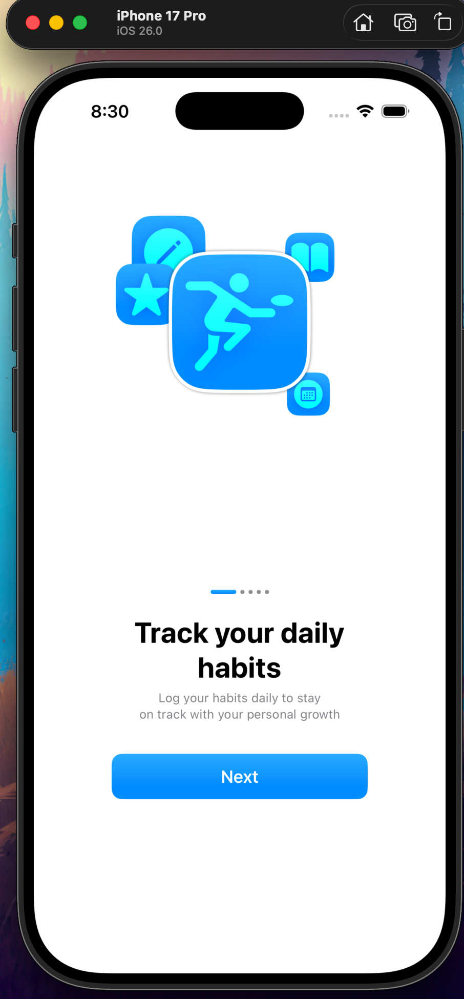
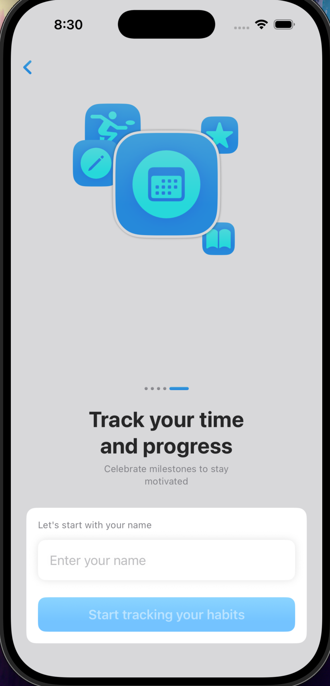
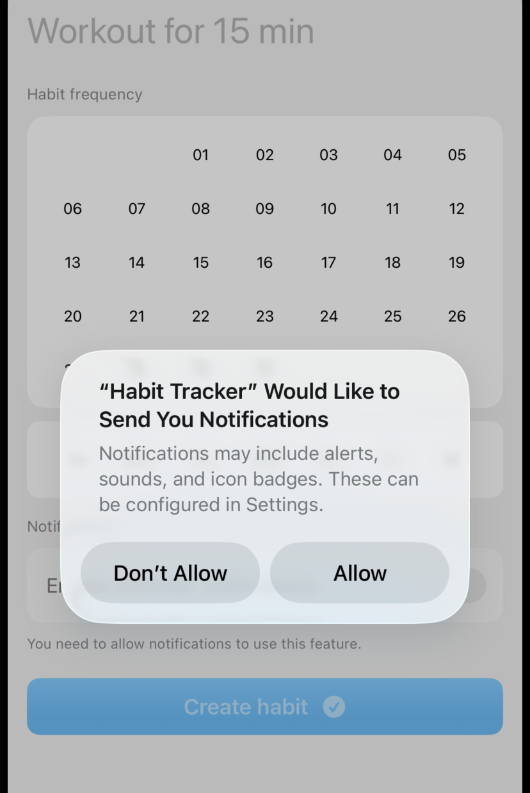
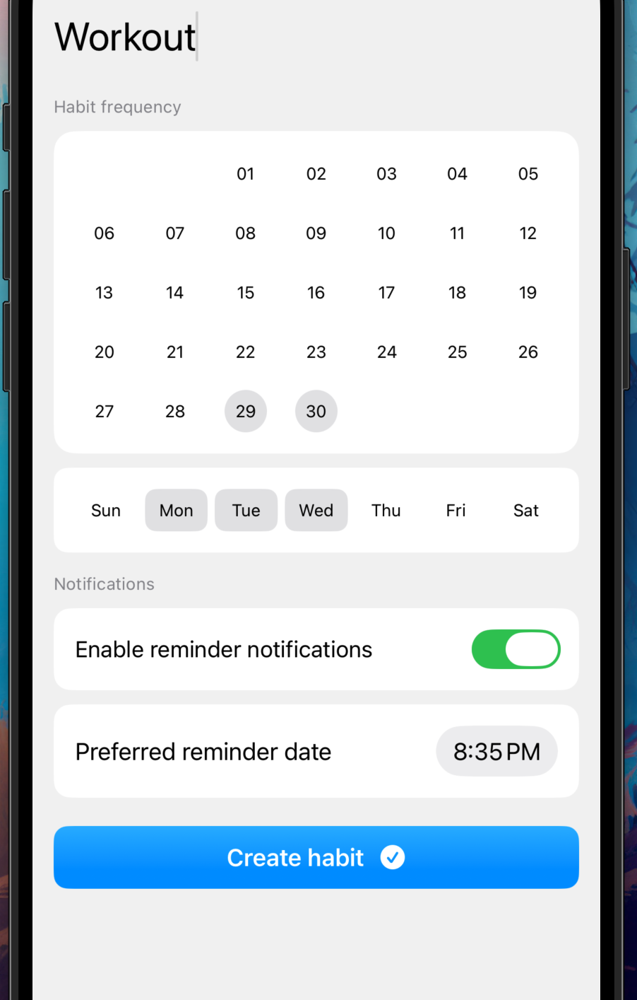
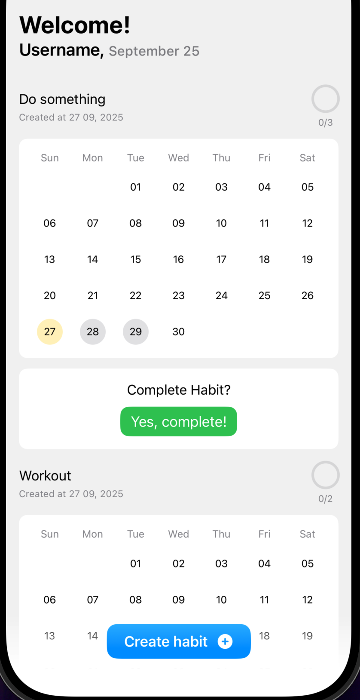
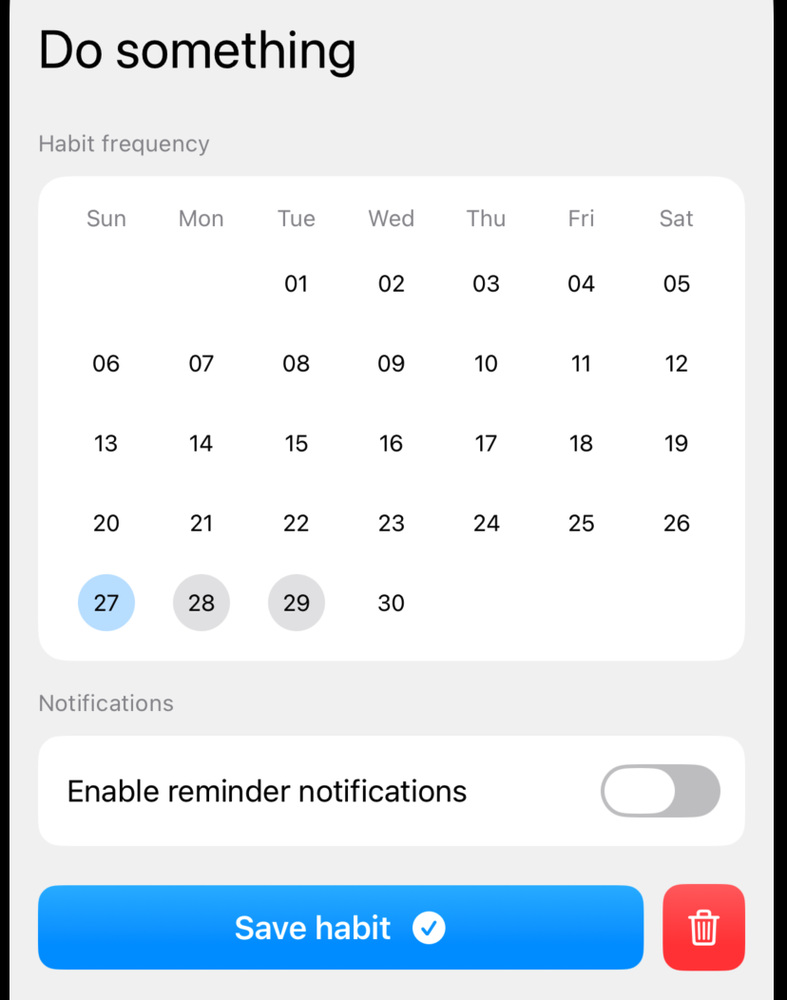

# Description

Habit Tracker is a simple but functional iOS app designed to assist users in tracking and managing their daily habits.

  
  
  
  
  
  

## Features
- **Introduction Pages**: Interactive onboarding screens that guide new users through the app’s purpose, key features, and how to use it effectively.
- **User Authentication & Customization**: Allows users to input their names and customize settings such as notifications and habit frequencies.
- **Habit Management**: Users can create, edit, and track various daily habits.

### Technologies Used
- SwiftUI for UI development.
- App Storage for user-specific data persistence.
- Custom animations and transitions to enhance user experience.

## Future Enhancements
1. Integrate habit creation functionalities.
2. Add more detailed notifications management.
3. Improve the visual design.
4. Improve MVVM organization

### Note

This project has been developed for learning purposes. Original idea came from 'Kavsoft'
